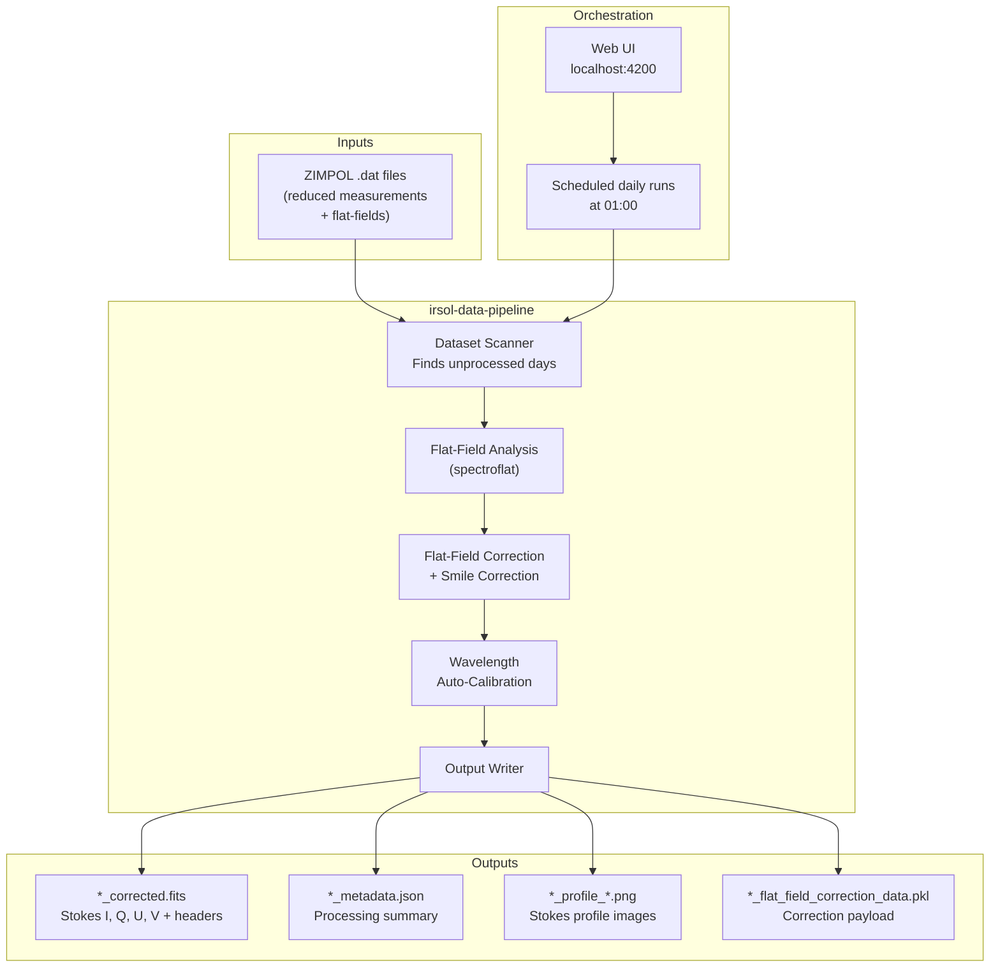
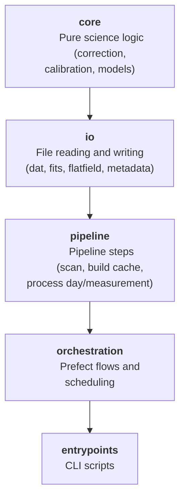
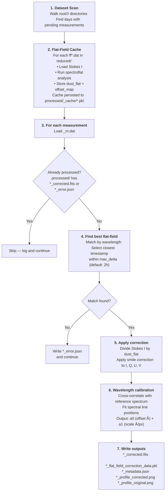
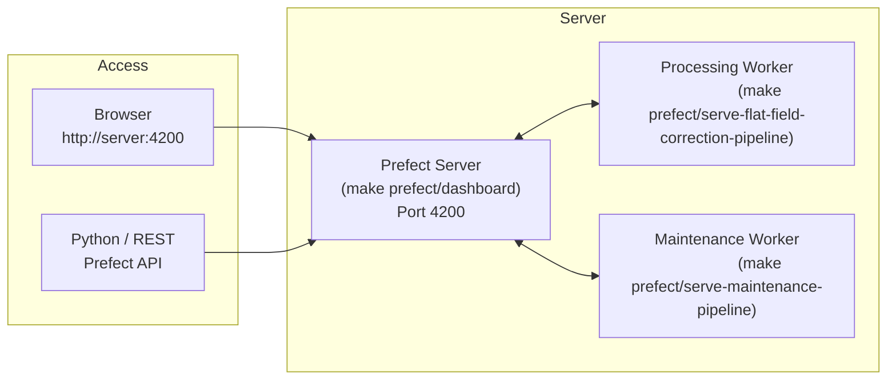

# IRSOL Data Pipeline


## Table of Contents

1. [What This Pipeline Does](#1-what-this-pipeline-does)
2. [Key Concepts and Terminology](#2-key-concepts-and-terminology)
3. [Repository Layout](#3-repository-layout)
4. [Installation](#4-installation)
5. [The Processing Pipeline — Step by Step](#5-the-processing-pipeline--step-by-step)
6. [Running the Pipeline](#6-running-the-pipeline)
   - [Quick start: process a single measurement](#61-quick-start-process-a-single-measurement)
   - [Visualising a processed FITS file](#62-visualising-a-processed-fits-file)
   - [Running the full pipeline locally](#63-running-the-full-pipeline-locally-without-prefect)
   - [Running the full pipeline with Prefect](#64-running-the-full-pipeline-with-prefect)
7. [Using the Pipeline as a Python Library](#7-using-the-pipeline-as-a-python-library)
8. [Managing Prefect Deployments in Production](#8-managing-prefect-deployments-in-production)
9. [Extending the System](#9-extending-the-system)
10. [Configuration Reference](#10-configuration-reference)
11. [Testing](#11-testing)


## 1. What This Pipeline Does

The IRSOL data pipeline automatically processes raw solar spectro-polarimetric measurements captured at the IRSOL observatory (Locarno, Switzerland).

### The problem it solves

Raw measurements from the ZIMPOL instrument contain optical artefacts that need to be corrected before the data is scientifically useful:

1. **Dust artefacts** — particles on the sensor create intensity patterns unrelated to the sun.
2. **Smile distortion** — spectral lines appear curved rather than straight due to optical aberrations.
3. **Unknown wavelength scale** — pixel positions must be mapped to physical wavelengths (Ångström) using a calibration procedure.

The pipeline corrects all three issues automatically, turning reduced `.dat` files into calibrated FITS files ready for scientific analysis.

### What it does in a single sentence

> For every reduced measurement in the dataset, the pipeline finds the best matching flat-field, applies flat-field and smile correction, calibrates the wavelength axis, and writes a corrected FITS file with metadata.

### High-level system diagram




## 2. Key Concepts and Terminology

Before diving into code, here is a glossary of domain terms used throughout the codebase:

| Term | What it means |
|---|---|
| **Stokes parameters (I, Q, U, V)** | Four numbers that fully describe the polarisation state of light. `I` is total intensity; `Q`, `U`, `V` describe linear and circular polarisation. Each is a 2D array `(n_spatial_pixels × n_wavelength_pixels)`. |
| **Flat-field (`.dat` file starting with `ff`)** | A calibration exposure taken of a uniform light source. It encodes the spatially-varying sensitivity of the sensor (dust artefacts) and the spectral-line curvature (smile). |
| **Flat-field correction** | Dividing each measurement by the flat-field to remove dust patterns, then geometrically unwarping spectral lines to straighten them. |
| **Smile distortion** | The bending of spectral lines across the spatial axis caused by optical misalignment. Corrected using the `spectroflat` library. |
| **Wavelength calibration** | The process of assigning a physical wavelength (in Ångström) to each pixel column. The pipeline does this automatically by cross-correlating the measured spectrum against bundled reference solar spectra. |
| **`max_delta`** | The maximum allowed time difference between a measurement and the flat-field used to correct it. If no flat-field is available within this window, processing fails with an error. Default: 2 hours. |
| **Observation day** | A directory under `<root>/<year>/<day>/` that contains subdirectories `raw/`, `reduced/`, and `processed/`. |
| **`reduced/`** | Directory containing raw `.dat` measurement and flat-field files from the instrument. |
| **`processed/`** | Directory where the pipeline writes all output files. |
| **FITS** | A standard astronomical data format. |


## 3. Repository Layout

```text
irsol-data-pipeline/
├── data/                          # Local dataset root for development and testing
├── documentation/                 # Extra documentation assets (screenshots, notes)
├── entrypoints/                   # Thin executable scripts (CLI and deployment bootstrap)
│   ├── serve_flat_field_correction_pipeline.py   # Start Prefect processing deployments
│   ├── serve_prefect_maintenance.py              # Start Prefect maintenance deployment
│   ├── process_single_measurement.py             # Process one .dat file from a terminal
│   └── plot_fits_profile.py                      # Visualise a processed FITS file
│
├── src/irsol_data_pipeline/
│   ├── core/                      # Scientific logic — no I/O, no orchestration
│   │   ├── models.py              # All shared data types (Pydantic models)
│   │   ├── config.py              # Shared constants and defaults
│   │   ├── correction/
│   │   │   ├── analyzer.py        # Analyse a flat-field → produces correction artefacts
│   │   │   └── corrector.py       # Apply the correction to a measurement
│   │   └── calibration/
│   │       ├── autocalibrate.py   # Wavelength calibration logic
│   │       └── refdata/           # Bundled reference solar spectra (.npy files)
│   │
│   ├── io/                        # File reading and writing — no science logic
│   │   ├── dat/
│   │   │   └── importer.py        # Read .dat/.sav → StokesParameters + info array
│   │   ├── fits/
│   │   │   ├── exporter.py        # Write StokesParameters → .fits
│   │   │   └── importer.py        # Read .fits → StokesParameters + CalibrationResult
│   │   ├── flatfield/
│   │   │   ├── exporter.py        # Serialise FlatFieldCorrection to .pkl
│   │   │   └── importer.py        # Load FlatFieldCorrection from .pkl
│   │   └── processing_metadata/
│   │       └── exporter.py        # Write *_metadata.json and *_error.json
│   │
│   ├── pipeline/                  # Orchestration of scientific steps (no Prefect dependency)
│   │   ├── filesystem.py          # Dataset discovery + canonical path helpers
│   │   ├── scanner.py             # Find observation days with pending measurements
│   │   ├── flatfield_cache.py     # Build and query the flat-field correction cache
│   │   ├── day_processor.py       # Process all measurements in one observation day
│   │   └── measurement_processor.py  # Process a single measurement end-to-end
│   │
│   ├── orchestration/             # Prefect-specific wiring (flows, decorators, logging)
│   │   ├── decorators.py          # Conditional @task/@flow (no-ops without PREFECT_ENABLED)
│   │   ├── patch_logging.py       # Forward loguru logs to Prefect's run logger
│   │   ├── retry.py               # Retry helper for Prefect tasks
│   │   ├── utils.py               # Prefect artifact helpers
│   │   └── flows/
│   │       ├── flat_field_correction.py   # Main processing flows
│   │       └── delete_old_prefect_data.py # Maintenance flow
│   │
│   ├── plotting/
│   │   └── profile.py             # Matplotlib Stokes profile plots
│   ├── exceptions.py              # All custom exception types
│   ├── logging_config.py          # Loguru configuration
│   └── version.py                 # Package version string
│
├── tests/unit/                    # Pytest unit tests
├── pyproject.toml
├── Makefile
└── README.md
```

### Layered architecture

The codebase is deliberately split into four independent layers — you can use lower layers without knowing anything about higher ones:



> **Key design rule**: The `core/` and `io/` layers have no knowledge of Prefect or the pipeline structure.
> This means you can import and call them directly as plain Python functions — no Prefect context required.


## 4. Installation

### Prerequisites

- Python ≥ 3.10
- [`uv`](https://github.com/astral-sh/uv) package manager

Install `uv` if you don't have it:

```bash
curl -LsSf https://astral.sh/uv/install.sh | sh
```

### Set up the environment

```bash
# Clone the repository (if not already done)
git clone <repo-url>
cd irsol-data-pipeline

# Create a virtual environment and install all dependencies
uv sync
```

All commands in this guide use `uv run <script>` which automatically activates the virtual environment.

### Available Make targets

```bash
make help                                      # List all targets
make lint                                      # Run pre-commit checks
make test                                      # Run tests with coverage
make prefect/dashboard                         # Start the Prefect server + dashboard
make prefect/serve-flat-field-correction-pipeline  # Serve the processing deployments
make prefect/serve-maintenance-pipeline        # Serve the maintenance deployment
make prefect/reset                             # Reset the local Prefect database
make clean                                     # Remove __pycache__ and .pyc files
```


## 5. The Processing Pipeline — Step by Step

This section explains exactly what happens when a measurement is processed. Understanding this will help you debug problems and extend the system.

### Dataset layout

The pipeline expects data organised like this:

```text
<root>/
└── 2025/
    └── 20250312/            ← observation day
        ├── raw/             ← raw camera files (not read by this pipeline)
        ├── reduced/         ← input files for this pipeline
        │   ├── 6302_m1.dat  ← measurement (wavelength 6302 Å, measurement id 1)
        │   ├── 6302_m2.dat
        │   ├── ff6302_m1.dat ← flat-field for wavelength 6302 Å
        │   └── ff6302_m2.dat
        └── processed/       ← output directory (created automatically)
```

**File naming conventions in `reduced/`:**
- Measurements: `<wavelength>_m<id>.dat` — e.g. `6302_m1.dat`
- Flat-fields: `ff<wavelength>_m<id>.dat` — e.g. `ff6302_m1.dat`
- Files starting with `cal` or `dark` are silently ignored.

### Step-by-step walkthrough

The pipeline runs through these stages for every observation day that has unprocessed measurements:



### Output files

For a source file `6302_m1.dat`, the pipeline produces inside `processed/`:

| File | Description |
|---|---|
| `6302_m1_corrected.fits` | Multi-extension FITS with four Stokes images (I, Q/I, U/I, V/I) and calibration headers |
| `6302_m1_flat_field_correction_data.pkl` | Serialised `FlatFieldCorrection` — can be reloaded to inspect or reapply the correction |
| `6302_m1_metadata.json` | Processing summary: timestamps, flat-field used, calibration values |
| `6302_m1_profile_corrected.png` | Plot of all four Stokes components after correction |
| `6302_m1_profile_original.png` | Plot of all four Stokes components before correction |
| `6302_m1_error.json` | Written **only** if processing fails — contains the error message |

Flat-field analysis cache files are stored separately under `processed/_cache/`:

| File | Description |
|---|---|
| `ff6302_m1_correction_cache.pkl` | Cached `FlatFieldCorrection` — reused across pipeline runs to avoid re-analysing flat-fields |

### Idempotency

The pipeline is **idempotent**: re-running it on a day that already has `*_corrected.fits` or `*_error.json` files will simply skip those measurements. To re-process a measurement, delete its output files from `processed/`.


## 6. Running the Pipeline

### 6.1 Quick start: process a single measurement

The fastest way to try the pipeline without setting up Prefect:

```bash
uv run entrypoints/process_single_measurement.py /path/to/reduced/6302_m1.dat
```

With explicit options:

```bash
uv run entrypoints/process_single_measurement.py /path/to/reduced/6302_m1.dat \
    --flatfield-dir /path/to/reduced \   # default: same directory as the measurement
    --output-dir    /path/to/processed \ # default: ../processed relative to reduced/
    --max-delta-hours 2.0 \              # default: 2.0
    --verbose                            # enable DEBUG logs
```

This script does not need a running Prefect server. It runs the full correction and calibration locally and writes all output files to `--output-dir`.

### 6.2 Visualising a processed FITS file

After processing, generate a Stokes profile plot from any `*_corrected.fits` file:

```bash
uv run entrypoints/plot_fits_profile.py /path/to/processed/6302_m1_corrected.fits
```

Save the plot to a custom path:

```bash
uv run entrypoints/plot_fits_profile.py /path/to/6302_m1_corrected.fits \
    --output /path/to/my_plot.png
```

The plot shows all four Stokes components (I, Q/I, U/I, V/I) as 2D images. When wavelength calibration is available in the FITS headers, the x-axis shows wavelengths in Ångström instead of pixel numbers.

### 6.3 Running the full pipeline locally (without Prefect)

You can drive the full scan-and-process loop directly from Python without any Prefect server:

```python
from pathlib import Path
from irsol_data_pipeline.pipeline.scanner import scan_dataset
from irsol_data_pipeline.pipeline.day_processor import process_observation_day

root = Path("/path/to/data")

# Find all observation days with pending measurements
scan_result = scan_dataset(root)
print(f"Days with pending work: {list(scan_result.pending_measurements.keys())}")

# Process each day
for day in scan_result.observation_days:
    if day.name in scan_result.pending_measurements:
        result = process_observation_day(day)
        print(f"{day.name}: processed={result.processed}, failed={result.failed}")
```

### 6.4 Running the full pipeline with Prefect

Prefect adds scheduling, a web UI, task retries, and structured logging.

**Step 1 — Start the Prefect server in one terminal:**

```bash
make prefect/dashboard
# Server starts at http://127.0.0.1:4200
```

**Step 2 — Serve the processing deployments in a second terminal:**

```bash
make prefect/serve-flat-field-correction-pipeline
```

This registers two deployments and keeps the process running as a worker:

| Deployment | Schedule | What it does |
|---|---|---|
| `run-flat-field-correction-pipeline` | Daily at 01:00 | Scans the whole dataset and processes all pending measurements |
| `run-daily-flat-field-correction-pipeline` | On demand | Processes a single observation day directory |

**Step 3 — Serve the maintenance deployment in a third terminal:**

```bash
make prefect/serve-maintenance-pipeline
```

| Deployment | Schedule | What it does |
|---|---|---|
| `delete-old-prefect-flow-runs` | Daily at 00:00 | Deletes Prefect run history older than 4 weeks |

**Step 4 — Trigger a run manually or wait for the schedule:**

1. Open `http://127.0.0.1:4200` in your browser.
2. Click **Deployments** in the left sidebar.
3. Select `run-flat-field-correction-pipeline`.
4. Click **Run → Quick Run** (uses default parameters) or **Run → Custom Run** to override:
   - `root`: dataset root path (default: `<repo>/data`)
   - `max_delta_hours`: maximum flat-field time gap in hours (default: `2.0`)
   - `max_concurrent_days_to_process`: parallelism cap (default: `CPU count − 1`, max 12)


**The `PREFECT_ENABLED` environment variable:**

The `@task` and `@flow` decorators in this codebase are conditional. When `PREFECT_ENABLED=true` is set (done automatically by `make prefect/serve-*`), they act like real Prefect decorators. Otherwise, they are transparent no-ops — meaning the same pipeline code runs perfectly fine without Prefect installed or running. This is what makes the library-style usage in Section 6.3 work.


## 7. Using the Pipeline as a Python Library

Because the scientific logic is isolated from the orchestration layer, every module can be imported and called independently.

### Reading a `.dat` file

```python
from pathlib import Path
from irsol_data_pipeline.io import dat as dat_io
from irsol_data_pipeline.core.models import MeasurementMetadata

stokes, info = dat_io.read(Path("6302_m1.dat"))

# stokes.i, stokes.q, stokes.u, stokes.v are 2D numpy arrays
print("Stokes I shape:", stokes.i.shape)   # e.g. (512, 1024)

# Parse the raw info array into a structured metadata object
metadata = MeasurementMetadata.from_info_array(info)
print("Wavelength:", metadata.wavelength)          # e.g. 6302
print("Observation start:", metadata.datetime_start)
```

### Analysing a flat-field

```python
import numpy as np
from irsol_data_pipeline.io import dat as dat_io
from irsol_data_pipeline.core.correction.analyzer import analyze_flatfield

stokes, info = dat_io.read("ff6302_m1.dat")

# Returns (dust_flat, offset_map, desmiled)
dust_flat, offset_map, desmiled = analyze_flatfield(stokes.i)
```

### Applying flat-field correction

```python
from irsol_data_pipeline.core.correction.corrector import apply_correction

corrected_stokes = apply_correction(
    stokes=measurement_stokes,
    dust_flat=dust_flat,
    offset_map=offset_map,
)
```

### Running wavelength calibration

```python
from irsol_data_pipeline.core.calibration.autocalibrate import calibrate_measurement

calibration = calibrate_measurement(corrected_stokes)

print(f"Pixel scale:       {calibration.pixel_scale:.4f} Å/px")
print(f"Wavelength offset: {calibration.wavelength_offset:.2f} Å")
print(f"Reference file:    {calibration.reference_file}")

# Convert pixel to wavelength
pixel = 256
wavelength = calibration.pixel_to_wavelength(pixel)
print(f"Pixel {pixel} → {wavelength:.2f} Å")
```

### Reading and writing FITS files

```python
from irsol_data_pipeline.io.fits.exporter import write_stokes_fits
from irsol_data_pipeline.io.fits.importer import load_fits_measurement
from pathlib import Path

# Write
output = Path("6302_m1_corrected.fits")
write_stokes_fits(output, corrected_stokes, metadata, calibration=calibration)

# Read back
imported = load_fits_measurement(output)
print("Re-loaded Stokes I shape:", imported.stokes.i.shape)
print("Calibration:", imported.calibration)
print("Header keyword DATE-OBS:", imported.header["DATE-OBS"])
```

### Building a flat-field cache and processing a single measurement

```python
from pathlib import Path
from irsol_data_pipeline.pipeline.filesystem import discover_flatfield_files
from irsol_data_pipeline.pipeline.flatfield_cache import build_flatfield_cache
from irsol_data_pipeline.pipeline.measurement_processor import process_single_measurement
from irsol_data_pipeline.core.models import MaxDeltaPolicy
import datetime

reduced_dir = Path("data/2025/20250312/reduced")
processed_dir = Path("data/2025/20250312/processed")

ff_paths = discover_flatfield_files(reduced_dir)
policy   = MaxDeltaPolicy(default_max_delta=datetime.timedelta(hours=2))
ff_cache = build_flatfield_cache(flatfield_paths=ff_paths, max_delta=policy.default_max_delta)

process_single_measurement(
    measurement_path = reduced_dir / "6302_m1.dat",
    processed_dir    = processed_dir,
    ff_cache         = ff_cache,
    max_delta_policy = policy,
)
```

### Generating a Stokes profile plot

```python
from irsol_data_pipeline.plotting import plot_profile

plot_profile(
    corrected_stokes,
    title="6302 Å | 2025-03-12",
    filename_save="profile.png",
    a0=calibration.wavelength_offset,
    a1=calibration.pixel_scale,
)
```


## 8. Managing Prefect Deployments in Production

This section covers what you need to do when the system runs on a server rather than a development laptop.

### Architecture in production

In production, three long-running processes must be kept alive simultaneously:



- **Prefect Server**: stores flow run history, schedules, and artefacts in a local SQLite database.
- **Processing Worker**: serves the `run-flat-field-correction-pipeline` and `run-daily-flat-field-correction-pipeline` deployments.
- **Maintenance Worker**: serves the `delete-old-prefect-flow-runs` deployment.

> The workers contact the Prefect server and poll for scheduled or manually triggered runs. If a worker is stopped, its deployments will not execute even if the server is running.

### Keeping workers alive (systemd or screen)

Use a process manager to keep all three processes running across reboots. Example using `screen`:

```bash
# Terminal 1 — Prefect server
screen -S prefect-server
make prefect/dashboard
# Ctrl+A, D  to detach

# Terminal 2 — Processing worker
screen -S processing-worker
make prefect/serve-flat-field-correction-pipeline
# Ctrl+A, D to detach

# Terminal 3 — Maintenance worker
screen -S maintenance-worker
make prefect/serve-maintenance-pipeline
# Ctrl+A, D to detach
```

For a production setup, prefer `systemd` unit files or a container orchestrator.

### Triggering a run manually

From the UI:
1. Open `http://<server>:4200`.
2. Go to **Deployments**.
3. Select the desired deployment and click **Quick Run** or **Custom Run**.

From the command line (with the Prefect server running):

```bash
# Trigger the full dataset pipeline
uv run prefect deployment run 'process-unprocessed-measurements/run-flat-field-correction-pipeline'

# Trigger a single-day run with a specific day path
uv run prefect deployment run \
    'process-unprocessed-daily-measurements/run-daily-flat-field-correction-pipeline' \
    --param day_path=/path/to/data/2025/20250312
```

### Overriding parameters at runtime

When triggering a run from the UI, you can override any parameter defined in the flow function signature:

| Parameter | Flow | Default | Description |
|---|---|---|---|
| `root` | `process-unprocessed-measurements` | `<repo>/data` | Dataset root path |
| `max_delta_hours` | both flows | `2.0` | Maximum flat-field time gap in hours |
| `max_concurrent_days_to_process` | `process-unprocessed-measurements` | CPU count − 1 (max 12) | How many days to process in parallel |
| `day_path` | `process-unprocessed-daily-measurements` | *(required)* | Path to a single observation day directory |
| `hours` | `delete-flow-runs-older-than` | `672` | Retention window in hours (default: 4 weeks) |
| `interactive` | `delete-flow-runs-older-than` | `false` | Ask for confirmation before deleting (useful in CLI) |

### Monitoring and logs

Prefect stores all logs, task states, and run metadata in its local database:

- **Flow run list**: `http://<server>:4200/runs`
- **Deployment list**: `http://<server>:4200/deployments`
- **Task runs for a flow**: click any flow run to expand its task tree and logs

Each processing run also publishes Prefect **artefacts**:
- A markdown scan summary (total measurements, pending counts per day).
- Per-measurement metadata JSON reports.
- Per-measurement error JSON reports when processing fails.

### Resetting Prefect state

If the Prefect database becomes corrupted or you want a clean slate:

```bash
# WARNING: this deletes ALL flow run history
make prefect/reset
```

After resetting, restart all three processes. The workers will re-register their deployments automatically on the next start.

### Scheduled cleanup

The maintenance deployment handles database growth automatically. Its default schedule (daily at midnight) deletes all flow runs older than 4 weeks. To change the retention window, edit `entrypoints/serve_prefect_maintenance.py` and update the `hours` parameter default, or override it when triggering a manual run.


## 9. Extending the System

### Adding a custom `MaxDeltaPolicy`

`MaxDeltaPolicy` controls how long a flat-field can be from a measurement to still be considered valid. The default applies the same threshold (2 hours) to every measurement.

You can subclass it to apply different thresholds per wavelength or instrument:

```python
import datetime
from irsol_data_pipeline.core.models import MaxDeltaPolicy

class MyPolicy(MaxDeltaPolicy):
    def get_max_delta(
        self,
        wavelength: int,
        instrument: str = "",
        telescope: str = "",
    ) -> datetime.timedelta:
        # Allow a wider window for 8542 Å measurements
        if wavelength == 8542:
            return datetime.timedelta(hours=6)
        return self.default_max_delta

# Use it like this
from irsol_data_pipeline.pipeline.day_processor import process_observation_day
result = process_observation_day(day, max_delta_policy=MyPolicy())
```

### Adding new reference spectra for wavelength calibration

Wavelength calibration works by cross-correlating the measured spectrum against reference spectra bundled in `src/irsol_data_pipeline/core/calibration/refdata/`.

To support a new wavelength:
1. Create a `.npy` reference spectrum file for the new wavelength range.
2. Drop it into `src/irsol_data_pipeline/core/calibration/refdata/`.
3. The calibration code (`autocalibrate.py`) automatically discovers and tries all files in that directory.

Alternatively, pass a custom `refdata_dir` to `calibrate_measurement`:

```python
from irsol_data_pipeline.core.calibration.autocalibrate import calibrate_measurement
from pathlib import Path

calibration = calibrate_measurement(
    stokes=corrected_stokes,
    refdata_dir=Path("/path/to/my/refdata"),
)
```

### Customising the flat-field analysis configuration

The `spectroflat` library accepts a `Config` object that controls the analysis. The default configuration is generated by `create_config_for_data` in `core/correction/analyzer.py`. To override analysis parameters:

```python
from irsol_data_pipeline.core.correction.analyzer import analyze_flatfield
from spectroflat import Config

# Build your own config
config = Config(...)
config.smile.line_distance = 20

dust_flat, offset_map, desmiled = analyze_flatfield(flat_stokes.i, config=config)
```

### Adding a new output format

Output writing is concentrated in `src/irsol_data_pipeline/io/`. To add a new format (e.g. HDF5):

1. Create a new directory `src/irsol_data_pipeline/io/hdf5/` with an `exporter.py`.
2. Implement a `write(path, stokes, metadata, calibration)` function following the same signature pattern as `io/fits/exporter.py`.
3. Call it from `pipeline/measurement_processor.py` after the existing `write_stokes_fits` call.
4. Add the new suffix constant to `core/config.py` and a new `ProcessedOutputKind` literal in `pipeline/filesystem.py`.

### Adding a new Prefect flow

All Prefect flows live in `src/irsol_data_pipeline/orchestration/flows/`. To add a new one:

1. Create a new file, e.g. `orchestration/flows/my_new_flow.py`.
2. Import and apply the conditional decorators:

```python
from irsol_data_pipeline.orchestration.decorators import flow, task

@flow(flow_run_name="my-new-flow/{param}")
def my_new_flow(param: str) -> None:
    ...
```

3. Create a serving entrypoint in `entrypoints/serve_my_new_flow.py`:

```python
from prefect import serve
from irsol_data_pipeline.orchestration.flows.my_new_flow import my_new_flow

deployment = my_new_flow.to_deployment(
    name="my-new-deployment",
    cron="0 2 * * *",   # daily at 02:00
)
serve(deployment)
```

4. Add a `make` target to `Makefile`:

```makefile
prefect/serve-my-new-flow:
    PREFECT_ENABLED=true uv run entrypoints/serve_my_new_flow.py
```

### Running scientific logic outside of Prefect

All `@task` and `@flow` decorators in this codebase are no-ops unless `PREFECT_ENABLED=true`. This means every function decorated with them is a plain Python function in any other context. You can import and call them freely:

```python
# Works without PREFECT_ENABLED and without a running Prefect server
from irsol_data_pipeline.pipeline.scanner import scan_dataset
from irsol_data_pipeline.pipeline.filesystem import discover_observation_days

days = discover_observation_days(root)          # decorated with @task, but still callable
scan = scan_dataset(root)                       # decorated with @task, but still callable
```


## 10. Configuration Reference

All shared constants are defined in `src/irsol_data_pipeline/core/config.py`:

| Name | Default | Description |
|---|---|---|
| `DEFAULT_MAX_DELTA` | `timedelta(hours=2)` | Default maximum allowed time between measurement and flat-field |
| `RAW_DIRNAME` | `"raw"` | Name of the raw data subdirectory inside an observation day |
| `REDUCED_DIRNAME` | `"reduced"` | Name of the reduced data subdirectory (pipeline input) |
| `PROCESSED_DIRNAME` | `"processed"` | Name of the processed output subdirectory |
| `CACHE_DIRNAME` | `"_cache"` | Name of the flat-field cache subdirectory inside `processed/` |
| `CORRECTED_FITS_SUFFIX` | `"_corrected.fits"` | Suffix for corrected FITS output files |
| `ERROR_JSON_SUFFIX` | `"_error.json"` | Suffix for error JSON files |
| `METADATA_JSON_SUFFIX` | `"_metadata.json"` | Suffix for processing metadata files |
| `FLATFIELD_CORRECTION_DATA_SUFFIX` | `"_flat_field_correction_data.pkl"` | Suffix for serialised correction payloads |
| `PROFILE_CORRECTED_PNG_SUFFIX` | `"_profile_corrected.png"` | Suffix for corrected Stokes profile plots |
| `PROFILE_ORIGINAL_PNG_SUFFIX` | `"_profile_original.png"` | Suffix for original Stokes profile plots |
| `V_STOKES_CUTOFF` | `0.4` | Threshold for filtering high-polarisation rows in auto-calibration |


## 11. Testing

Run the full test suite with coverage:

```bash
make test
```

This runs `pytest` with coverage reports in HTML (`htmlcov/`) and XML (`coverage.xml`).

To run a single test file:

```bash
uv run pytest tests/unit/test_scanner.py -v
```

To run tests matching a keyword:

```bash
uv run pytest -k "flatfield" -v
```

### Test layout

Tests live in `tests/unit/`.
