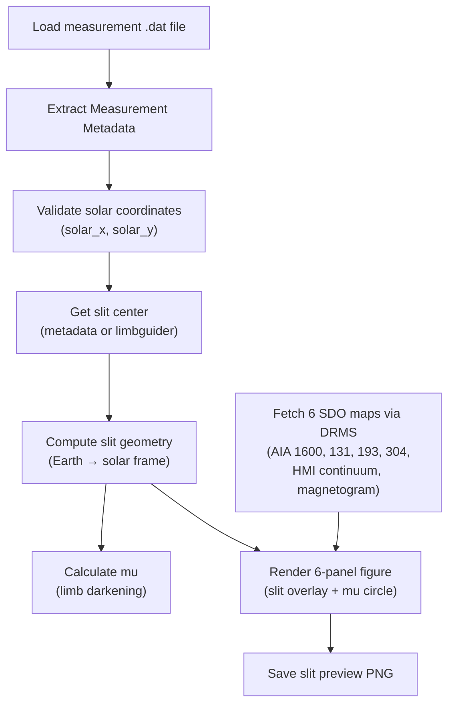

# Slit Image Creation

Slit image creation generates six-panel contextual preview images showing the spectrograph slit position overlaid on SDO/AIA and SDO/HMI solar images. These previews help researchers visualize exactly where on the solar disc each measurement was taken.

## Purpose

- Compute the spectrograph slit geometry in the solar reference frame.
- Fetch contemporaneous SDO context images (UV, EUV, continuum, magnetogram).
- Render a publication-quality 6-panel figure showing the slit on each data product.
- Provide the **mu** value (cos θ, limb-darkening parameter) for the observation.

## Processing Flow

## Caching

Downloaded SDO FITS files are cached in the `processed/_cache/sdo/` directory per observation day, avoiding redundant downloads across measurements.

## Inputs / Outputs

| | Description | Format |
|---|---|---|
| **Input** | Measurement `.dat` file (for metadata) | ZIMPOL IDL save-file |
| **Input** | JSOC email (for DRMS queries) | String |
| **Output** | Slit preview image | PNG file (`*_slit_preview.png`) |
| **Output** | Error metadata (on failure) | JSON file (`*_slit_preview_error.json`) |

## Related Documentation

- [Pipeline Overview](../pipeline/pipeline_overview.md) — slit image generation in the full pipeline
- [Prefect Integration](../pipeline/prefect_integration.md) — scheduling of slit image flows
- [IO Modules](../io/io_modules.md) — metadata import/export
