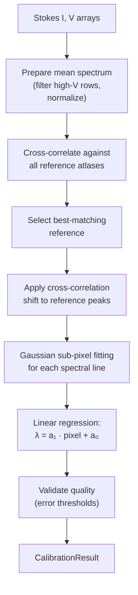

# Wavelength Auto-Calibration

Wavelength auto-calibration establishes a mapping from detector pixel position to absolute wavelength (in Ångströms). The algorithm cross-correlates the observed spectrum against bundled reference atlases and refines individual line positions with Gaussian sub-pixel fitting.

**Module:** `core.calibration.autocalibrate`

## Purpose

- Convert the pixel axis of a spectrogram into an absolute wavelength axis.
- Provide a linear calibration model: **λ = a₁ · pixel + a₀**.
- Estimate calibration uncertainties (1-σ errors on a₀ and a₁).
- Identify which reference atlas best matches the observation.

## Processing Flow



## Results

The calibration produces a `CalibrationResult` model:

| Field | Type | Description |
|-------|------|-------------|
| `pixel_scale` (a₁) | `float` | Ångströms per pixel |
| `wavelength_offset` (a₀) | `float` | Wavelength at pixel 0 |
| `pixel_scale_error` | `float` | 1-σ error on a₁ |
| `wavelength_offset_error` | `float` | 1-σ error on a₀ |
| `reference_file` | `str` | Name of the best-matching atlas |
| `peak_pixels` | `np.ndarray` | Fitted peak positions (pixels) |
| `reference_lines` | `np.ndarray` | Wavelengths of reference lines (Å) |

The model provides convenience methods:

```python
result.pixel_to_wavelength(500)   # → wavelength at pixel 500
result.wavelength_to_pixel(6302)  # → pixel position of 6302 Å
```

## Inputs / Outputs

| | Description | Format |
|---|---|---|
| **Input** | Corrected Stokes parameters (I, V) | `StokesParameters` model (2-D arrays) |
| **Input** | Reference data directory | Path to `.npy` atlas files |
| **Output** | Calibration result | `CalibrationResult` Pydantic model |

## Reference Data

Reference spectral atlases are bundled in `core/calibration/refdata/` as NumPy `.npy` files. Each file contains a dictionary with:

- **Spectrum** — normalized 1-D reference spectrum.
- **Peak positions** — pixel locations of known spectral lines in the reference.
- **Line wavelengths** — absolute wavelengths (Å) of the spectral lines.
- **Calibration parameters** — the reference's own a₀ and a₁ values.

## Related Documentation

- [Flat-Field Correction](flat_field_correction.md) — runs before calibration
- [Pipeline Overview](../pipeline/pipeline_overview.md) — calibration in the full pipeline context
